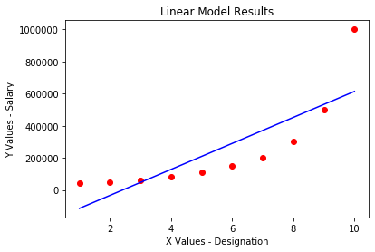
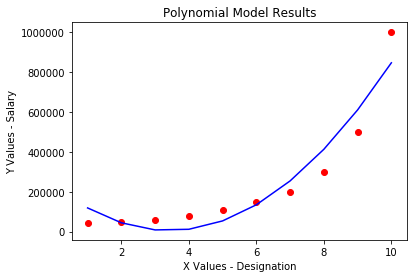
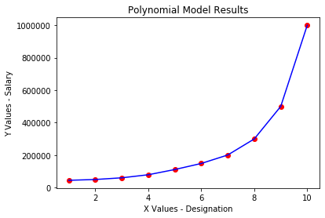

# PolynomialRegression_Python
A simple non-linear polynomial regression model learnt from online ML tutorials.

In the following, the first image shows a polynomial expression of degree one, ie **a linear regression model**.
Subsequent models have a degree > 1 and are **non-linear regression model**, which increases their accuracy to compute correct values of the y-value for any independent x-value depending on the dataset provided.

>*Graph of fitting line for linear regression*

---
>*Graph of fitting line for non-linear regression (degree 2)*

---
>*Graph of fitting line for non-linear regression (degree 3)*

---
>*Graph of fitting line for non-linear regression (degree 8)*

