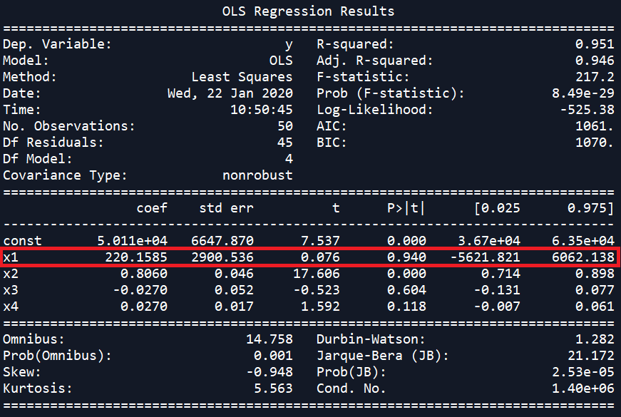
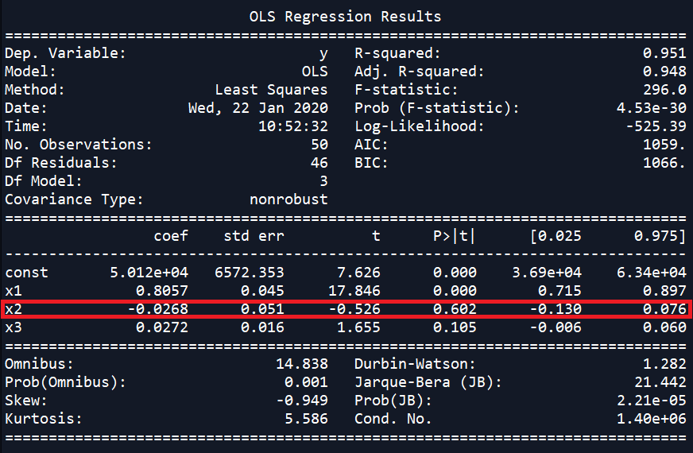
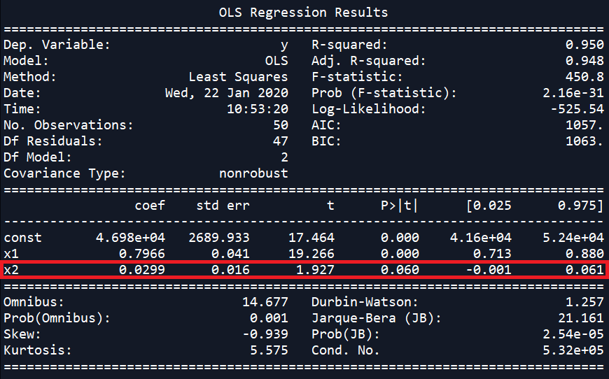
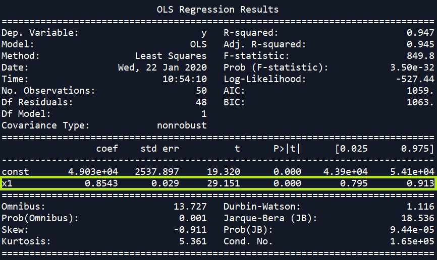

# MultiLinearRegression_Python

A simple Multi-Regression model learnt from online ML tutorials, optimized using Backward Elimination method.

Backward Elimination Method

1) Select a significance level to stay in the model (eg. SL = 0.05 in this example)
2) Fit the model with all possible predictors
3) Consider the predictor with the highest P-value. If P>SL, go to step 4.
4) Remove the predictor

Fit the model without this variable and repeat the step 3 until the condition becomes false.

In the following the variables with **red borders are the predictors which will be removed** in the net consecutive steps. The **green borders illustrate the final most significant variables left**.

>*Regression summary with all 4 variables*

---
>*Regression summary with 3 most significant variables*

---
>*Regression summary with 2 most significant variables*

---
>*Regression summary with the single most significant varible*

